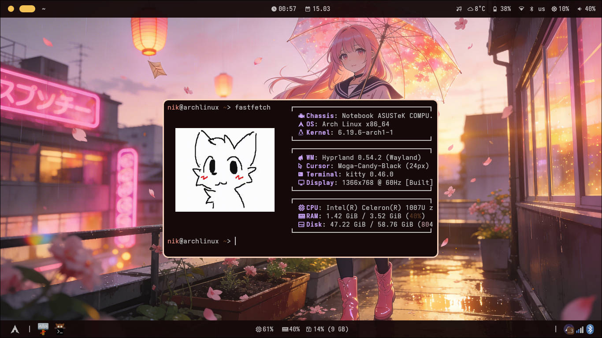
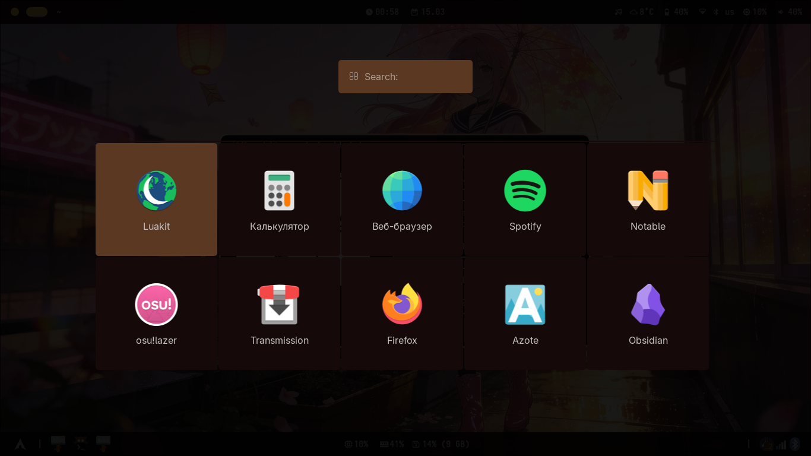
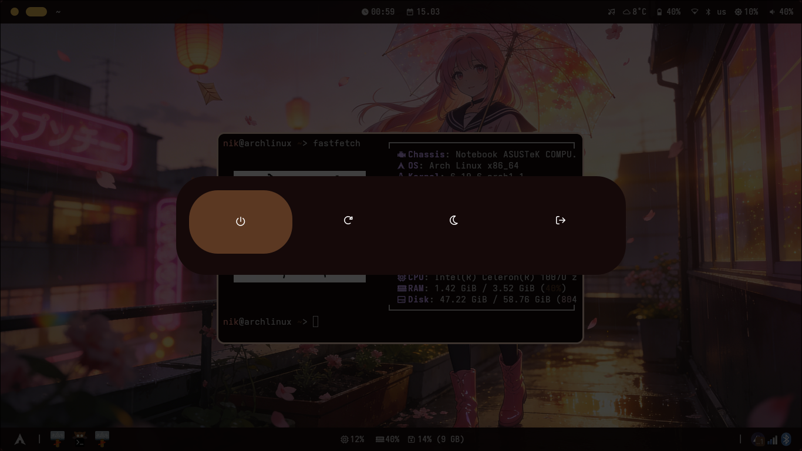

# My wal-based rice (fits any wallpaper)





- Compositors: niri, hyprland
- Status bar: waybar
- Brightness manager: brightnessctl
- Sound: pactl, pipewire, pipewire-pulse, wireplumber
- Terminal: kitty
- Shell: fish
- Wallpapers daemon: swww
- Menus: rofi
- Firefox theming: pywalfox
- Fonts: otf-font-awesome, noto-fonts-emoji, AdwaitaMono Nerd Font

## Installation:
```
git clone https://github.com/r1v3ra-1508/dotfiles
cd dotfiles
mv -f ./* ~
cd ..
rm -r dotfiles
```

## How to change wallpaper?
> Open ~/scripts/niri-startup.sh. There you can change wall's filename, walls directory and blurred walls directory

## Notes:
1. If you see "Unable to parse $color14 as a color", type "hyprctl reload" in terminal. It happens cuz hyprland loads faster then wal generates colors.
2. Please, in `"default_path": "/home/nik/.themes/<THEME_NAME>"` in `.config/oomox/export_config/multi_export_wal-theme-apply.json` replace "nik" with your username. Else GTK theme won't generate.
