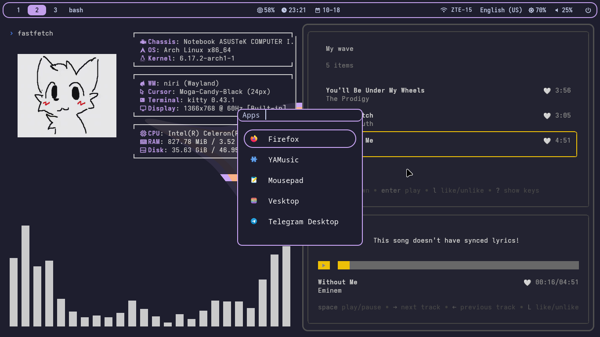

# My Catppuccin Mocha colored rice

Dependencies: niri, waybar, brightnessctl, pactl, networkmanager_dmenu, kitty, swww, rofi, starship, pulseaudio, otf-font-awesome, noto-fonts-emoji, AdwaitaMono Nerd Font

1. Move files from this repo to your home directory
2. Replace "nik" in configs to your username (cfgs likebinds in niri)

I use GTK apps like Thunar so i added Catppuccin theme. Command to apply it: ```gsettings set org.gnome.desktop.interface "catppuccin-mocha-mauve"```
