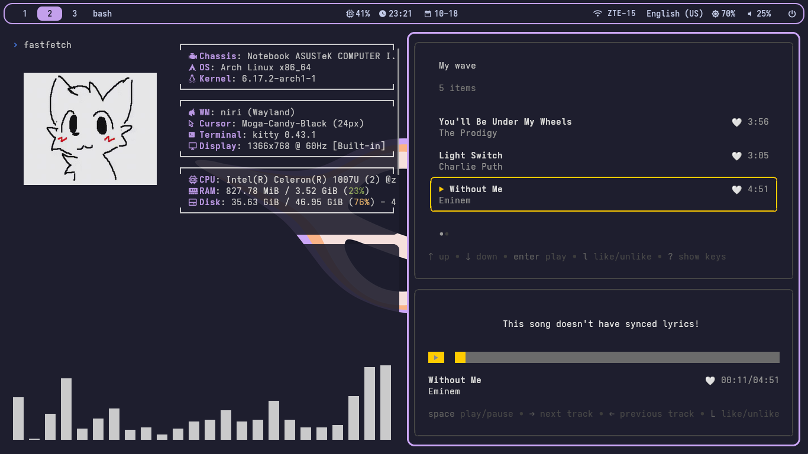
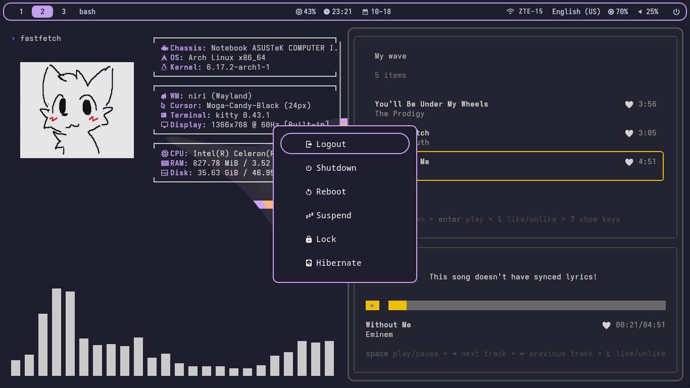

# My Catppuccin Mocha colored rice

Dependencies: niri, waybar, brightnessctl, pactl, networkmanager_dmenu, kitty, swww, rofi, starship, pipewire, pipewire-pulse, wireplumber, otf-font-awesome, noto-fonts-emoji, AdwaitaMono Nerd Font

Just move files from this repo to your home directory

## How to change wallpaper?
> Open ~/scripts/niri-startup.sh. There you can change wall's filename, walls directory and blurred walls directory

I use GTK apps like Thunar so i added Catppuccin theme. Command to apply it: ```gsettings set org.gnome.desktop.interface "catppuccin-mocha-mauve"```

Check my Catppuccin Mocha theme for Firefox: [*click*](https://color.firefox.com/?theme=XQAAAAJ1AQAAAAAAAABBKYhm849SCia6aSqEGccwS-xMDPr3HHCUaapJkrAKdd4ot9fnLdQhLd1msGOtHxTKT40WxHZarvQrWhVrdB1YszU2kEbExh7Q_IMlNHGUGvSnnWDDZqb0arbW3R9xJ2A0NevaP2JbM4fDqRir_54N2SD_h2yrE3GPywTQAkPs_JlZKx_HAmvfYVNXpXjiBkQ1mvs-sW4Ik8zPoQ93wmKEKIUEBsN1ap4VpUmKMRn-EKInYdkb-5S4LDGIuaf_9dVh4A)
